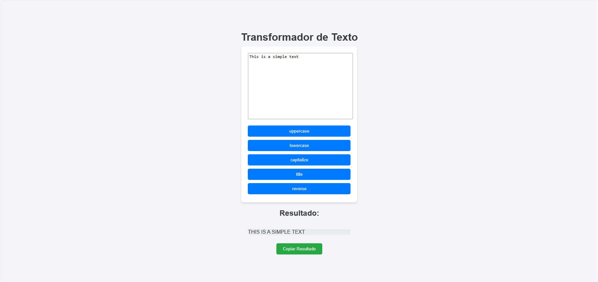

# Modificador de textos

## Sobre

Este projeto foi desenvolvido com o objetivo de aprimorar minhas habilidades em Django e Python. O principal intuito é ajudar iniciantes a construir uma base sólida em programação web.

## Layout

## Tecnologias Usadas

- Python
- Django
- JavaScript (opcional)
- HTML
- CSS

## Como usar

1. Clone the repository:

https://github.com/LucasSobrinh0/identificador_de_cores

2. Crie o banco de dados:

python manage.py makemigrations

python manage.py migrate

3. Instale as dependências:

pip install -r requirements.txt

4. Rode o servidor:

python manage.py runserver

## Autor

Lucas Sobrinho Carneiro

Linkedin: https://www.linkedin.com/in/lucas-sobrinho-c-b9b6661b9/

Email: lucas.sobrinho.crn@gmail.com
